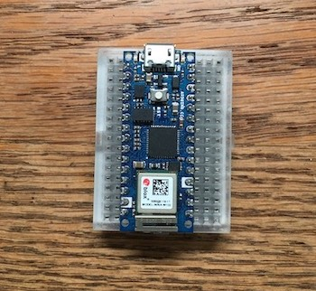
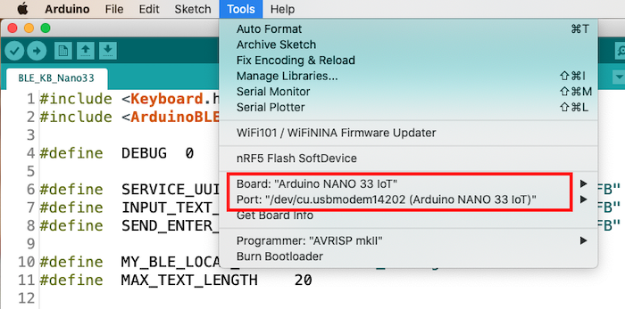
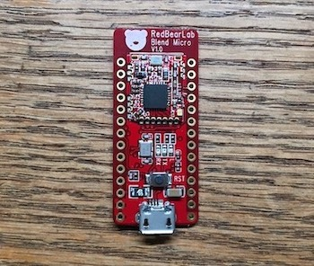

# AutoPass app

使用 iPhone 的 Touch ID 搭配 Arduino Nano 33 解鎖自己的電腦。

[Demo 影片](https://twitter.com/riddle_ling/status/1272561538843373568?s=20)


## 原理解說

本專案主要分為兩個部分：

1. Arduino HID Keyboard
2. iOS app

Arduino HID Keyboard 的程式碼放在 `BLE_KB_Nano33` 目錄下，iOS app 的程式碼放在 `AutoPassApp` 目錄下。

本專案的原理很簡單，用一塊 arduino 模擬成 HID Keyboard，然後 iOS app 透過 BLE 把密碼傳送給 arduino 裝置，接著 arduino 裝置再把密碼輸入到電腦，利用這種方式去解鎖電腦。


## Arduino HID Keyboard

### 1. 材料準備：

我使用 [Arduino Nano 33 IoT](https://store.arduino.cc/usa/nano-33-iot) 來當 HID Keyboard，所以需要先購買一塊 Nano 33 IoT。




### 2. 為 arduino 裝置取一個名稱：

接著下載本 repo 的程式碼，然後用 Arduino IDE 開啟 `BLE_KB_Nano33` 目錄裡的 `BLE_KB_Nano33.ino`，修改 `MY_BLE_LOCAL_NAME` 的字串值：保留 `AutoPass_` 前綴，後面的 wcling 可以改成你喜歡的名字，例如：`AutoPass_john`、`AutoPass_mary` 之類的。


**改名稱很重要，尤其是當同一個房間裡有好幾台 arduino 裝置時，如果名稱都一樣，就很難判斷要傳送資料到哪一台。**

### 3. 上傳程式到 arduino：

請先依照 [Getting started with the Arduino NANO 33 IoT](https://www.arduino.cc/en/Guide/NANO33IoT) 這篇教學安裝好 NANO 33 IoT 所需的工具程式，然後在 Arduino IDE 的 Library Manager 裡搜尋 ArduinoBLE 並安裝之。

把 Nano 33 IoT 連接到電腦，然後在 Arduino IDE 裡選好 Board 與 Port，然後按下 Upload 按鈕，如下圖所示：




## 安裝 iOS app

用 Xcode 開啟 `AutoPassApp` 目錄下的 `AutoPassApp.xcodeproj`，然後把 app 安裝到你的 iPhone 上。


## 如何使用

### 1. 執行 AutoPass app：

啟動 app 後，首先會出現掃描到的 BLE 裝置，選擇你的 arduino 裝置後，會進到主畫面。

按主畫面右上的 `+` 按鈕，可以新增一個電腦密碼，然後可以選擇輸入密碼後，是否要傳送一個 `Enter` 鍵。

如下圖所示：


### 2. 解鎖自己的電腦：

新增後的電腦會顯示在主畫面，在主畫面按下電腦名稱，就會跳出 Touch ID 的畫面，把手指放到 iPhone 的 Home 鍵上，指紋驗證成功的話，就會把密碼傳送給 arduino 裝置，然後 arduino 裝置就會自動把密碼鍵入電腦！


## Q&A

### Q: `BLE_KB_Nano33.ino` 的 `MY_BLE_LOCAL_NAME` 字串值一定要使用 `AutoPass_` 做前綴名稱嗎？

**A:** 如果你想使用自己定義的前綴名稱，請修改 iOS app 的 `ViewController.swift`，把這一行：

```
let bleDevice = MyBLEDevice(prefixName: "AutoPass")
```

的 prefixName 改成你自定義的前綴名稱 (當 app 掃描 BLE 裝置時，只會列出有此前綴名稱的裝置)，如下圖所示。

然後你就可以在 `BLE_KB_Nano33.ino` 的 `MY_BLE_LOCAL_NAME` 字串值使用自定義的前綴名稱了。


### Q: 最多可傳送幾個字元的密碼？

**A:** 經過測試，目前 `Arduino Nano 33 IoT` 的 BLE 一次最多只能接收 20 個字元，所以，如果你的密碼超過 20 個字元，這個 app 可能不適用於你。


## 更新日誌

- 2020/06/21 新增 Blend Micro HID Keyboard 的程式碼，提供 Nano 33 Iot 以外的另一種選擇，程式碼放在 `BLE_KB_BlendMicro` 目錄下。 (Blend Micro 在 Arduino IDE 裡的 Board 是選 Arduino Leonardo，且需要先在 Library Manager 裡搜尋 BLEPeripheral 並安裝之。)




## 無著作權宣告

本專案目錄下的程式碼屬於[公眾領域](https://en.wikipedia.org/wiki/Public_domain)，你可以複製、修改、發布或展示此程式，亦可進行商業利用，完全不需要經過許可。但是，當使用或引用此程式時，不得暗喻作者或指認該著作之人，為你的行為背書。

